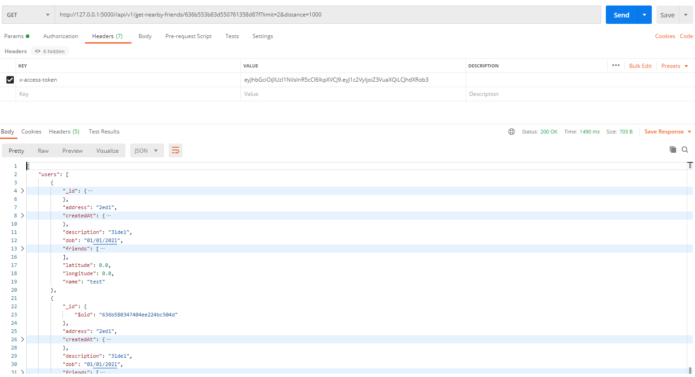

# Ryde-Backend
## Table of Contents
* [Introduction](#introduction)
* [Running the application](#running-the-application)
* [Consuming the API](#consuming-the-api)
* [Application Architecture](#application-architecture)
* [User Design](#user-design)
* [Functionalities](#functionalities)
+ [Authorization](#authorization)
    - [Valid Token](#valid-token)
    - [Invalid Token](#invalid-token)
+ [Get User](#get-user)
    - [Successful Request](#successful-request)
    - [Unsuccessful Request](#unsuccessful-request)
+ [Get Users](#get-users)
    - [Successful Request](#successful-request-1)
+ [Delete User](#delete-user)
    - [Successful Request](#successful-request-2)
    - [Unsuccessful Request](#unsuccessful-request-1)
+ [Create User](#create-user)
    - [Successful Request](#successful-request-3)
    - [Unsuccessful Request](#unsuccessful-request-2)
+ [Update User](#update-user)
    - [Successful Request](#successful-request-4)
    - [Unsuccessful Request](#unsuccessful-request-3)
+ [Add Friend](#add-friend)
    - [Successful Request](#successful-request-5)
    - [Unsuccessful Request](#unsuccessful-request-4)
+ [Find Nearby Friends](#find-nearby-friends)
    - [Successful Request](#successful-request-6)
    - [Unsuccessful Request](#unsuccessful-request-5)
* [Logger Strategy](#logger-strategy)
* [Testing](#testing)

## Introduction

Ryde-Backend is a REST API designed to communicate with MongoDB and perform **CRUD operations** to get/create/update/delete users from the **users** collection in the respective db. 

It has been implemented with the following functionalities:

1. Add/Delete/Update/Get user or users to the DB
2. Associate an already existing user with another existing user in the db
3. Get nearby friends within the given proximity *distance*
4. Logging 
5. User auth using jwt token (generated by the client)

**Tech Stack Used**
- Database: MongoDB Atlas (cloud database)
- Server: Python, Flask framework.
- Client: Python (jwt auth)

## Running the application

The following things need to be done before you can get the application working:

1. Accessing MongoDB cluster
   
   MongoDB was chosen as the database as **NoSQL was the preffered database** to be chosen for the project. The database was hosted on MongoDB Atlas (multi-cloud database service). The cluster was hosted using the free tier through a dummy account. 

   The database can be accessed by following these steps:
   1. Visit the following link: [mongodb](https://www.mongodb.com)
   2. Click SignIn
   3. Enter the following email: gunitmittal.ryde.test@gmail.com
   4. Password for login: GunitBackend@525
   5. Click the **Ryde** project, you will be able to see the dashboard for different operations such as connection_requests, data throughput etc.
   6. Click **Browse Collections** and you can view the required users collection under *rydedb.users*.

2. Setting up the environment

   Flask was chosen as the framework for development as it is lightweight, offers a lot of flexibility and highly scalable. Moreover, it helps in rapid development to keep up with the fast-paced environment.

   Flask Blueprints have been used for developing the application as it helps in modularizing the code, and makes it more extensible. 

   These are the following steps to set up the application:
    1. Clone the project from the (github repository)[https://github.com/gmit22/ryde-backend]
    2. Ensure that you have python installed in your device. If this is not the case, you can find the release from (here)[https://www.python.org/downloads/]
    3. Get the virtualenv module using the command `pip install virtualenv`
    4. Create a virtualenv using the command `python -m venv backend-virtualenv`. Activate the virtualenv using `source backend-virtualenv/bin/activate`
    5. Install all the modules required to run the project using `pip install -r requirements.txt` from the root directory.

3. Generating a client token
    1. Run `python client_token.py` from the root directory. You should see an output similar to this in the terminal:
    
    2. Copy the generated token, and include it in the header for any future requests with **header-key: 'x-access-token' and header-value: token**.

4. Running the server
    1. Run the following command in the server directory    ```python run.py```

## Consuming the API
We can use Postman to consume and test the different endpoints exposed. Ensure that for all API requests, the generated `jwt token` is included in each request as a header with key `x-access-token`.

These are the endpoints available:
1. POST `/api/v1/user` -> creates a new user in the db
1. GET `/api/v1/user` -> retrieves all the stored users from the db
1. GET `api/v1/user/<id>` ->  retrieves user corresponding to the given id from the db (if it exists)
1. POST `/api/v1/delete-user/<id>` -> deletes user corresponding to the given id from the db (if it exists)
1. PUT `api/v1/update-user/<id>` -> updates the user corresponding to the given id (if it exists)
1. PUT `api/v1/add-friend?userId=<user-id>&friendId=<friend-id>` -> associates users corresponding to user-id and friend-id as friends
1. GET `api/v1/get-nearby-friends/<id>?distance=<distance>` -> gets all the friends of the user who are within the mentioned proximity.

Given is an example of how postman can be used to consume endpoints exposed by the server.


## Application Architecture


## User Design

`_id` is uniquely assigned to each user by mongoDB. This is also used as unique key to identify users present in the database since it is possible for different users to have the same field value for the other entries.

```
class User(BaseModel):

    _id: ObjectId
    name: str
    dob: date
    address: str
    description: str
    createdAt: datetime
    friends: list
    latitude: float
    longitude: float
```

## Functionalities

The application supports the following functionalities.

### Authorization
User authroization is implemented using the `jwt` library, which helps in generating and verifying the token signature sent by the user request.

The user/client and the server share a `SECRET_KEY`, which helps the client generate a token that is valid for 15 minutes. This token needs to be included in the `x-accept-token` header key by the user.

As described in the user blueprint, a token verification is executed before proceeding to any of the API calls using the `token_required` decorater.

#### Valid Token
In case of a valid token, the user request carries out as expected and returns successfully.


#### Invalid Token
In case of an invalid token, the user request is returned with a `401 Unauthorized` response.


### Get User
Used to get user's information corresponding to the `id` provided by the user.

`GET http://localhost:5000/api/v1/user/<id>`

#### Successful Request

#### Unsuccessful Request

In case a user corresponding to the given `id` is not found in the db, we return a `404 Not Found` response.


> **_NOTE:_**  We Can return `204 No Content success` to depict that the non-existent client has been deleted, but `404` seems more fit since the client does not exist.

### Get Users
Used to get all the users present in the database.

`GET http://localhost:5000/api/v1/users`

#### Successful Request


### Delete User
Used to delete a user from the db corresponding to the `id` provided in the request.

`POST http://localhost:5000/api/v1/delete-user/<id>`

#### Successful Request


#### Unsuccessful Request

In case a user corresponding to the given `id` is not found in the db, we return a `404 Not Found` response.


### Create User
Used to create and add a new user to the database. If successful, returns the `u_id` to identify different users in the db.

`POST http://localhost:5000/api/v1/user`

These are the possible fields present in the request to create and add a new user to the db.

| Field      | Type | Optional     |
| :---        |    :----:   |          ---: |
| name      | `str`       | Required|
| address   | `str`        | Required      |
| description      | `str`       | Required   |
| dob   | `str`        | Required |
| latitude      | `float`       | Optional   |
| longitude  | `float`    | Optional|
| friends | `list`    | Optional or None|
| createdAt   | `datetime.datetime`        | Optional or None|

#### Successful Request
In case the request is successful, and all the pre-checks for user are satisfied, the user is added to the database and returns a `201 Created` response.


#### Unsuccessful Request
In case the user proviedes `createdAt` as a field in the given input, we do not add the user in the db and return `400 Bad Request`.


We ensure that each of the fields provided match the expected type. For instance, we expect description to be a `str` but we return an error in case it is not of the expected type `int`.


### Update User
Used to update user details in the database. Arguments to update the required user are provided as query parameters

`PUT http://localhost:5000/api/v1/update-user/<id>`

#### Successful Request
In case the request is successful, the user data is updated in the db and returns a `200 Ok` response.


#### Unsuccessful Request
In case the user provides a `u_id` corresponding to which a user doesn't exist in the given database, it returns a `404 Not Found` response. 


These are the following fields that can be includeded as a query parameter for updating the user:

| Field      | Type | Optional     |
| :---        |    :----:   |          ---: |
| id      | `ObjectId`       | Required|
| name      | `str`       | Optional|
| address   | `str`        | Optional      |
| description      | `str`       | Optional   |
| dob   | `str`        | Optional |
| latitude      | `float`       | Optional   |
| longitude  | `float`    | Optional|

### Add Friend
For implementing this feature, we assume in case *user_1* is associated with *user_2* as a friend then *user_2* is also associated with *user_1* as a friend.

`PUT http://localhost:5000/api/v1/add-friend?friendId=<friendId>&userId=<userId>`

#### Successful Request
In case the request is successful, the *userId* is added to the *friendId* as a friend and the *friendId* is added to the *userId** as a friend.


#### Unsuccessful Request
In case the user provides a *friendId* corresponding to a user who doesn't exist in the given database, it returns a `404 Not Found` response. 


In case the user provides the same `_id` for *friendId* and *userId*, we return a `400 Bad Request` since a user can't be added as their own friend.


### Find Nearby Friends

Used to get all the friends for the user corresponding to `id`, and filter them based on their proximity `distance` from the user. In case `limit` is `None`, we return all the friends satisfying the given criteria.

`GET http://localhost:5000/api/v1/get-nearby-friends/<id>?distance=<distance>&limit=<limit>`

#### Successful Request
In case the request is successful, we get the list of friends satisfying the given proximity criteria.



In case no friends satisfying the given criteria exist, we return a `200 Ok` response as the request has been processed.


#### Unsuccessful Request
In case no location co-ordinates (latitude and longitude) are found for the user corresponding to `id`, we return a `400 Bad Request` response as it cannot be processed.


## Logger Strategy

The `logging` module was used to assist in implementing the logger strategy.

Logging is done at a high level where results and errors are generated. Hence, logging is mostly implemented in `user_client.py`.

The logger is instantiated using the following line:

```code
logging.basicConfig(level=logging.DEBUG, format=f'%(asctime)s %(levelname)s %(name)s %(threadName)s : %(message)s')
```

## Testing

The following libraries were used for testing:

`from unittest.mock import patch`

While testing, it was important to isolate services such that test data is not pushed into the production db database. `mock` and `patch` in python were used to mock the responses.  

Run the following command in the server directory to execute unit test.
`python -m unittest test_user_client.py`


We have also initialised a test client and app to execute integration test by connecting to a local database whose specs are provided in the **TestConfig**.

```
class TestConfig:

    MONGO_HOST = 'localhost'
    MONGO_PORT = 27017
    MONGO_DBNAME = 'ryde-db'
    MONGO_URI = f"mongodb://{MONGO_HOST}:{MONGO_PORT}/{MONGO_DBNAME}"
    TESTING = True
```
